# Дипломное задание по курсу «DevOps-инженер»
```
Цели:
    Зарегистрировать доменное имя (любое на ваш выбор в любой доменной зоне).
    Подготовить инфраструктуру с помощью Terraform на базе облачного провайдера YandexCloud.
    Настроить внешний Reverse Proxy на основе Nginx и LetsEncrypt.
    Настроить кластер MySQL.
    Установить WordPress.
    Развернуть Gitlab CE и Gitlab Runner.
    Настроить CI/CD для автоматического развёртывания приложения.
    Настроить мониторинг инфраструктуры с помощью стека: Prometheus, Alert Manager и Grafana.
```
# Этапы выполнения:

## Регистрация доменного имени

Подойдет любое доменное имя на ваш выбор в любой доменной зоне.
ПРИМЕЧАНИЕ: Далее в качестве примера используется домен you.domain замените его вашим доменом.
Рекомендуемые регистраторы:
• nic.ru
• reg.ru

Цель:
    Получить возможность выписывать TLS сертификаты для веб-сервера.

Ожидаемые результаты:
    У вас есть доступ к личному кабинету на сайте регистратора.
    Вы зарезистрировали домен и можете им управлять (редактировать dns записи в рамках этого домена).
	
- **Был зарегистрирован домен denis-netology.site на reg.ru**


## Создание инфраструктуры

Для начала необходимо подготовить инфраструктуру в YC при помощи Terraform.

Конфигурация инфраструктуры находится в папке [terraform](terraform/).

Предварительная подготовка:
    Создайте сервисный аккаунт, который будет в дальнейшем использоваться Terraform для работы с инфраструктурой с необходимыми и достаточными правами. Не стоит использовать права суперпользователя
    Подготовьте backend для Terraform:

а. Рекомендуемый вариант: Terraform Cloud
б. Альтернативный вариант: S3 bucket в созданном YC аккаунте.

- **Создан S3 бакет в Yandex Cloud**

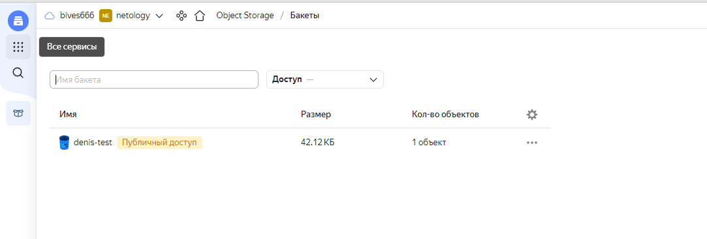


- **Домен был делегирован под управление ns1.yandexcloud.net и ns2.yandexcloud.net**

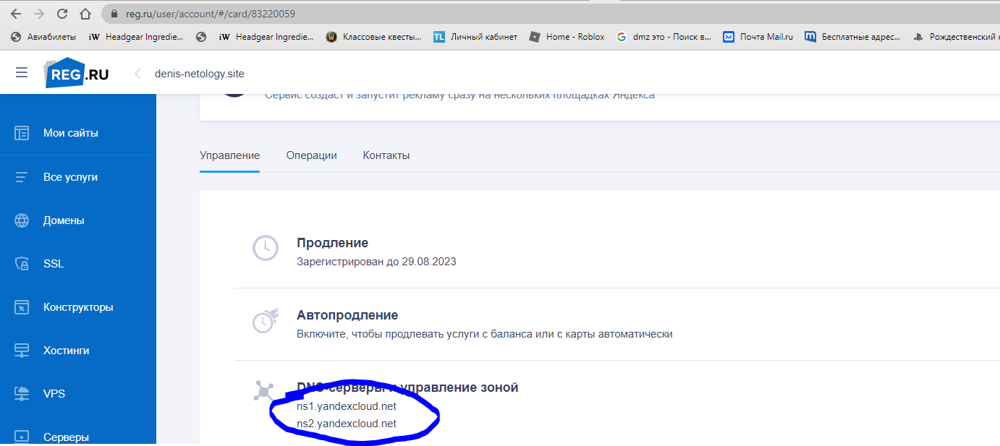

    Создайте VPC с подсетями в разных зонах доступности.
    Убедитесь, что теперь вы можете выполнить команды terraform destroy и terraform apply без дополнительных ручных действий.
    В случае использования Terraform Cloud в качестве backend убедитесь, что применение изменений успешно проходит, используя web-интерфейс Terraform cloud.

Цель:
    Повсеместно применять IaaC подход при организации (эксплуатации) инфраструктуры.
    Иметь возможность быстро создавать (а также удалять) виртуальные машины и сети. С целью экономии денег на вашем аккаунте в YandexCloud.

Ожидаемые результаты:
    Terraform сконфигурирован и создание инфраструктуры посредством Terraform возможно без дополнительных ручных действий.
    Полученная конфигурация инфраструктуры является предварительной, поэтому в ходе дальнейшего выполнения задания возможны изменения.
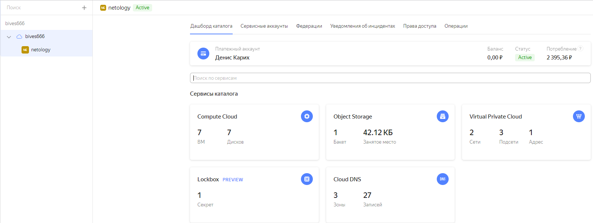    
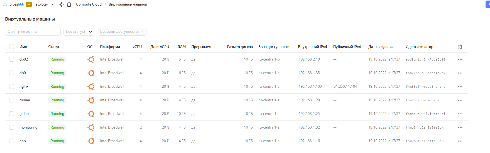


## Установка Nginx и LetsEncrypt

Необходимо разработать Ansible роль для установки Nginx и LetsEncrypt.
Для получения LetsEncrypt сертификатов во время тестов своего кода пользуйтесь тестовыми сертификатами, так как количество запросов к боевым серверам LetsEncrypt лимитировано.

Все Ansible роли находятся в папке [ansible](ansible/).

Рекомендации:
• Имя сервера: you.domain
• Характеристики: 2vCPU, 2 RAM, External address (Public) и Internal address.

Цель:
    Создать reverse proxy с поддержкой TLS для обеспечения безопасного доступа к веб-сервисам по HTTPS.

Ожидаемые результаты:
    В вашей доменной зоне настроены все A-записи на внешний адрес этого сервера:

    https://www.you.domain (WordPress)
    https://gitlab.you.domain (Gitlab)
    https://grafana.you.domain (Grafana)
    https://prometheus.you.domain (Prometheus)
    https://alertmanager.you.domain (Alert Manager)

    Настроены все upstream для выше указанных URL, куда они сейчас ведут на этом шаге не важно, позже вы их отредактируете и укажите верные значения.
    В браузере можно открыть любой из этих URL и увидеть ответ сервера (502 Bad Gateway). На текущем этапе выполнение задания это нормально!
	
 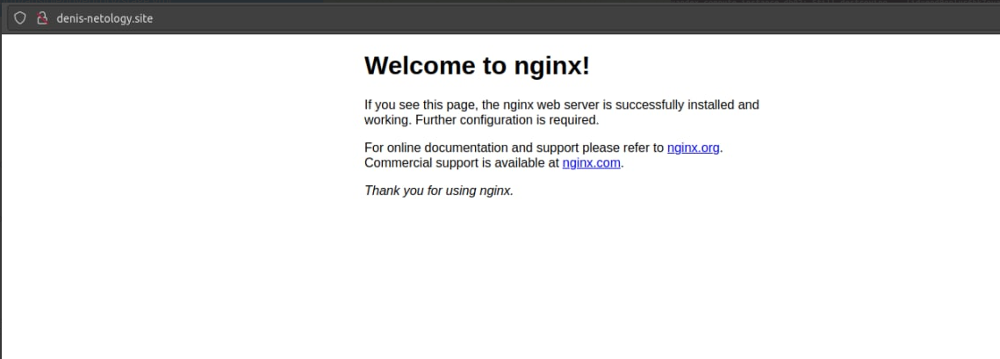

 
## Установка кластера MySQL

Необходимо разработать Ansible роль для установки кластера MySQL.

Все Ansible роли находятся в папке [ansible](ansible/).

Рекомендации:
• Имена серверов: db01.you.domain и db02.you.domain
• Характеристики: 4vCPU, 4 RAM, Internal address.

Цель:
    Получить отказоустойчивый кластер баз данных MySQL.

Ожидаемые результаты:
    MySQL работает в режиме репликации Master/Slave.
    В кластере автоматически создаётся база данных c именем wordpress.
    В кластере автоматически создаётся пользователь wordpress с полными правами на базу wordpress и паролем wordpress.

## Установка WordPress

Необходимо разработать Ansible роль для установки WordPress.

Все Ansible роли находятся в папке [ansible](ansible/).

Рекомендации:
• Имя сервера: app.you.domain
• Характеристики: 4vCPU, 4 RAM, Internal address.

Цель:
    Установить WordPress. Это система управления содержимым сайта (CMS) с открытым исходным кодом.
По данным W3techs, WordPress используют 64,7% всех веб-сайтов, которые сделаны на CMS. Это 41,1% всех существующих в мире сайтов. Эту платформу для своих блогов используют The New York Times и Forbes. Такую популярность WordPress получил за удобство интерфейса и большие возможности.

Ожидаемые результаты:
    Виртуальная машина на которой установлен WordPress и Nginx/Apache (на ваше усмотрение).
    В вашей доменной зоне настроена A-запись на внешний адрес reverse proxy:

    https://www.you.domain (WordPress)
	
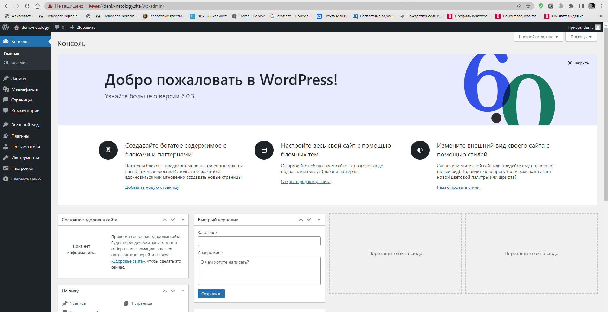


## Установка Gitlab CE и Gitlab Runner


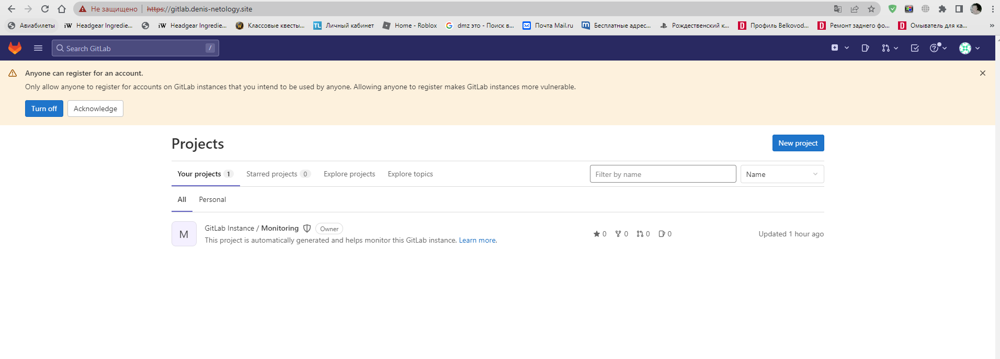

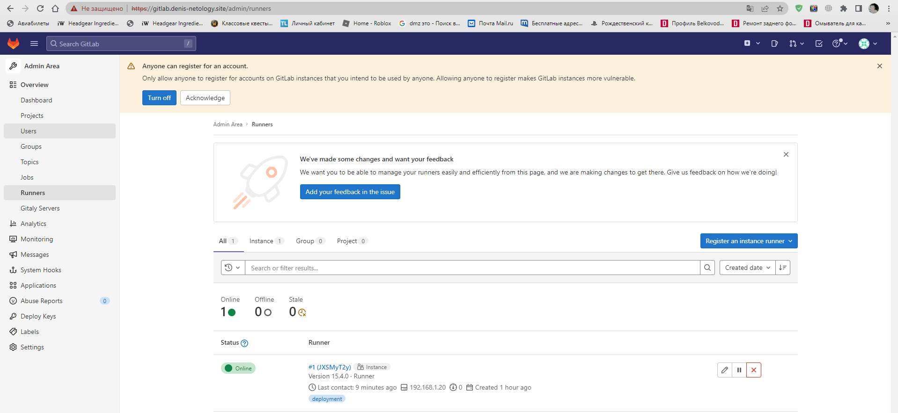

Необходимо настроить CI/CD систему для автоматического развертывания приложения при изменении кода.

Реализацию CI/CD находится [тут](gitlab-ci-cd/).

Рекомендации:
• Имена серверов: gitlab.you.domain и runner.you.domain
• Характеристики: 4vCPU, 4 RAM, Internal address.

Цель:
    Построить pipeline доставки кода в среду эксплуатации, то есть настроить автоматический деплой на сервер app.you.domain при коммите в репозиторий с WordPress.
    Подробнее о Gitlab CI

Ожидаемый результат:
    Интерфейс Gitlab доступен по https.
    В вашей доменной зоне настроена A-запись на внешний адрес reverse proxy:

    https://gitlab.you.domain (Gitlab)
	


Подготовка GitLab к автоматическому развертыванию
	Создаем новый публичный репозиторий для нашего проекта.
	Загружаем в него наш файл `.gitlab-ci.yml` и папку с темой `wp-content`.\
	Подготавливаем `Runner` для работы с нашем проектом.

После завершения настройки, GitLab CI/CD автоматически развернет новую тему для WordPress.

 - **Успешно выполненный `pipeline`**
 
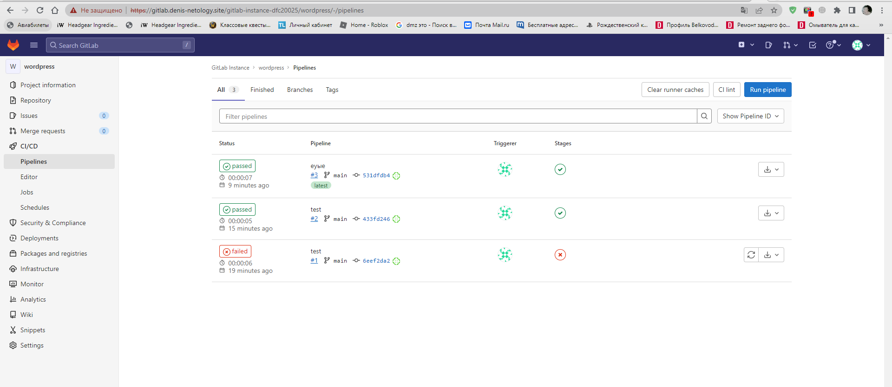
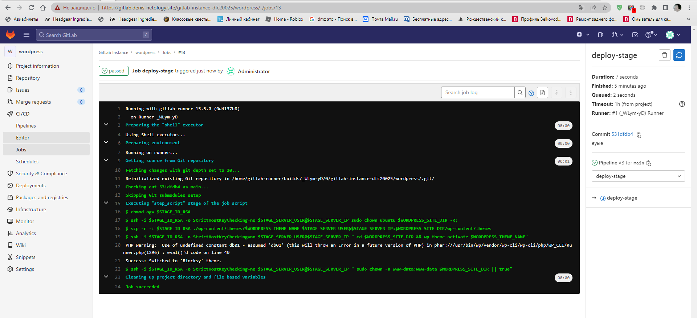

 - **Измененная тема на нашем сайте Wordpress**
 
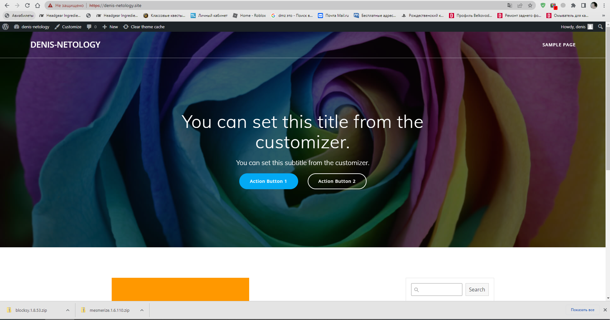

## Установка Prometheus, Alert Manager, Node Exporter и Grafana

Необходимо разработать Ansible роль для установки Prometheus, Alert Manager и Grafana.
Рекомендации:
• Имя сервера: monitoring.you.domain
• Характеристики: 4vCPU, 4 RAM, Internal address.

Цель:
    Получение метрик со всей инфраструктуры.

Ожидаемые результаты:
    Интерфейсы Prometheus, Alert Manager и Grafana доступены по https.
    В вашей доменной зоне настроены A-записи на внешний адрес reverse proxy:
    • https://grafana.you.domain (Grafana)
    • https://prometheus.you.domain (Prometheus)
    • https://alertmanager.you.domain (Alert Manager)

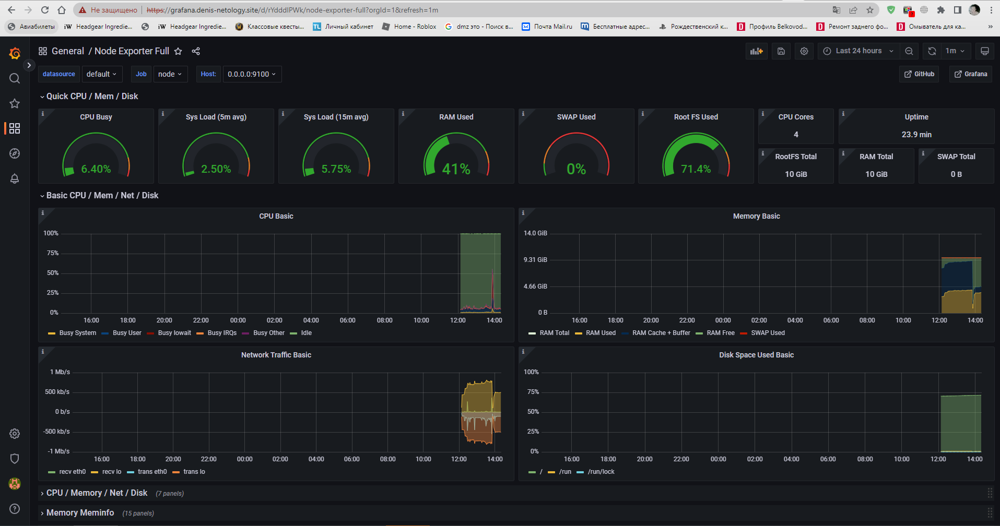
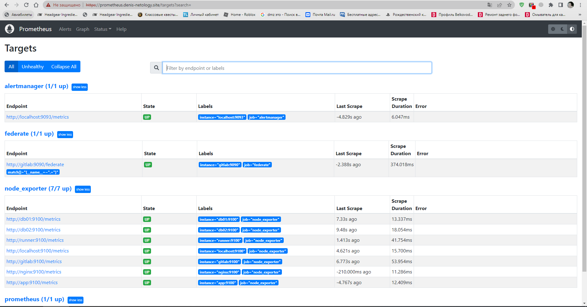
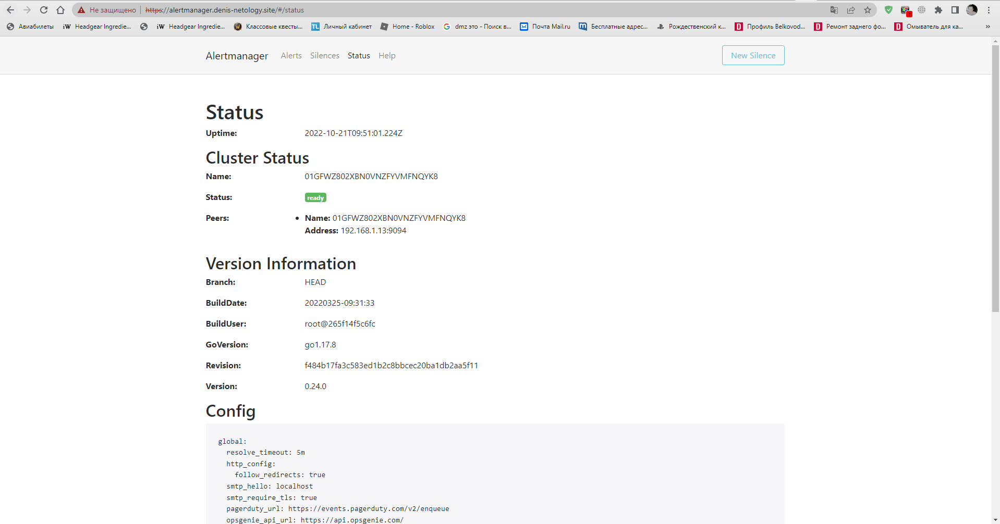


